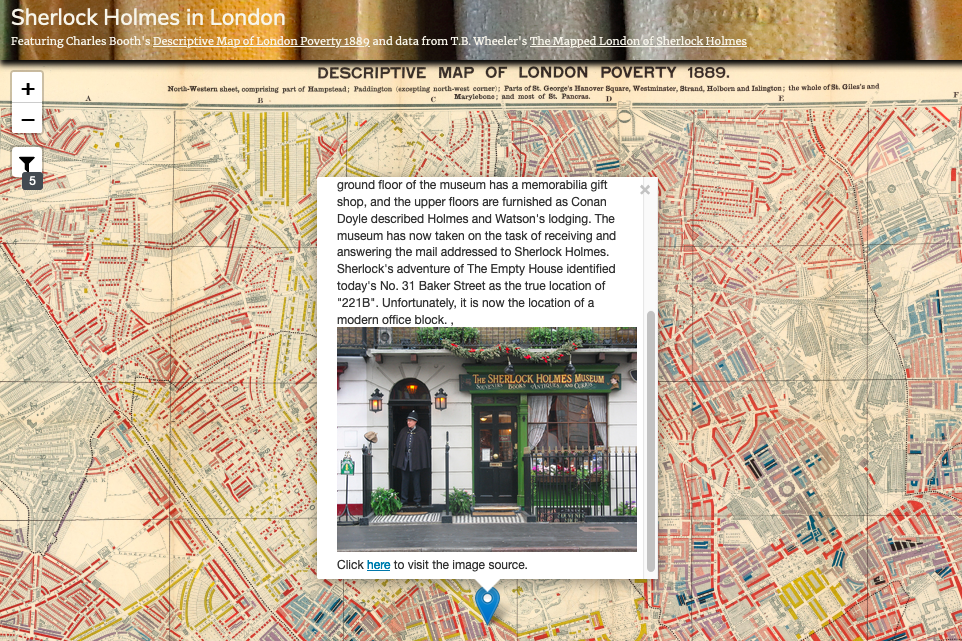

# Digital Mapping for the Humanities
Jay Bowen, Digital Scholarship and Publishing Studio, University of Iowa Libraries

## Credits
- [The London of Sherlock Holmes](https://www.google.com/maps/d/viewer?ll=51.510345653313024%2C-0.12769532132744787&z=14&mid=11hi6OwDoifyUI4kFsg7suBQm1t8), by Thomas Bruce Wheeler
- [Descriptive Map of London Poverty 1889](https://davidrumsey.georeferencer.com/maps/b0af04e4-993d-52da-b642-1051e9877e7f/), from the David Rumsey Map Collection
- [Place context analysis using Natural Language Processing](https://github.com/jakobzhao/geog595/tree/master/06_ai), Bo Zhao
- [Word2Vec](https://github.com/sankyfox/word2vec), Sankalp Kolhe
- [Google News and Leo Tolstoy: Visualizing Word2Vec Word Embeddings using t-SNE](https://towardsdatascience.com/google-news-and-leo-tolstoy-visualizing-word2vec-word-embeddings-with-t-sne-11558d8bd4d), Sergey Smetanin

## Contents
- [Introduction](#introduction)
- [Required Technology](#required-technology)
- [Download This Repository](#download-this-repository)
- [Download the London Basemap](#download-the-london-basemap)
- [Using QGIS](#using-qgis)
  - [Map the Spreadsheet Data with QGIS](#map-the-spreadsheet-data-with-qgis)
  - [Adding a Basemap](#adding-a-basemap)
  - [Changing Projections](#changing-projections)
  - [Adding a Georeferenced Historic Basemap](#adding-a-georeferenced-historic-basemap)
- [Leaflet JavaScript for Web Mapping](#leaflet-javascript-for-web-mapping)
  - [Export a GeoJSON File for Web Mapping](#export-a-geojson-file-for-web-mapping)
  - [Open Atom and Download Atom-Live-Server Package](#open-atom-and-download-atom-live-server-package)
  - [Add the Sherlock GeoJSON to a Web Map Using Atom](#add-the-sherlock-geojson-to-a-web-map-using-atom)
  - [Crowdsourced Web Mapping with Google Sheets](#crowdsourced-web-mapping-with-google-sheets)
- [Text Analysis, Geolocation, and Network Mapping with Python, QGIS, and Gephi](#text-analysis-geolocation-and-network-mapping-with-python-qgis-and-gephi)
  - [Open the ipynb File in Jupyter Notebook](#open-the-ipynb-file-in-jupyter-notebook)
  - [Save Required Files in the Project Folder](#save-required-files-in-the-project-folder)
  - [Map Locations in The Adventures of Sherlock Holmes with QGIS](#map-locations-in-the-adventures-of-sherlock-holmes-with-qgis)
  - [Map a Network of Word Associations from The Adventures of Sherlock Holmes with Gephi](#map-a-network-of-word-associations-from-the-adventures-of-sherlock-holmes-with-gephi)
- [Conclusion](#conclusion)

## Introduction
This tutorial is an overview of digital mapping in the humanities. Through the steps provided here, you will gain a cursory introduction in how to:

- Use desktop GIS software to map a pre-collected spreadsheet of points from the Sherlock Holmes series onto a georeferenced historic map of London
- Save a geojson file of these points for later use in web mapping
- Use a text editor to reference this geojson file in pre-written JavaScript to produce an interactive web map
- Use a text editor to reference a shared Google spreadsheet of these points in pre-written JavaScript
- Add images to the Google spreadsheet to demonstrate the potential for crowdsourcing in an interactive web map
- Use Python code in Jupyter Notebook to analyze The Adventures of Sherlock Holmes
- Use Python to identify, measure the frequency, and geocode mentioned locations in the text
- Use Python to identify important words from the text and identify their most similar relatives from other words in the text
- Use Gephi to map these word connections as a network to visualize broad themes in the text

## Required Technology
This tutorial focuses on open-source approaches to digital mapping in the humanities. All of the required technology is free to download and use. For all steps using GIS, we will use [QGIS](https://www.qgis.org/en/site/). For interactive web mapping, we will use [Leaflet](https://leafletjs.com/), a JavaScript library created specifically for web mapping. For editing the code that creates our online map, we will use a text editor called [Atom](https://atom.io/). For text analysis, we will execute [Python](https://www.python.org/) code in [Jupyter Notebook](https://jupyter.org/) using a [JupyterHub](https://jupyterhub.readthedocs.io/en/latest/) server created with [GESIS Notebooks' Binder](https://notebooks.gesis.org/binder/) service. Finally, for network mapping of analyzed text, we will use [Gephi](https://gephi.org/). Before you begin, you must download these from the following sites:

- [QGIS](https://qgis.org/en/site/forusers/download.html)
- [Atom](https://atom.io/)
- [Gephi](https://gephi.org/users/download/)
- [Our GESIS Notebooks Binder](https://notebooks.gesis.org/binder/v2/gh/jebowe3/Text-Analysis-Binder/HEAD)

## Download This Repository
Before opening QGIS, you should download this repository and save it to your desktop so that you can work with the files included here. You can download a zip file of this repository from the [link included here](https://github.com/jebowe3/YBY-Tutorial/archive/refs/heads/main.zip). Unzip this folder and save it to your desktop.

## Download the London Basemap
Now, you will need to download the georeferenced historic basemap of London. This is a map of London poverty drafted by Charles Booth in 1889. It is contemporaneous to Doyle's Sherlock Holmes series and will provide good historical context to our map.

Download the map from the [link included here](https://drive.google.com/file/d/1udpezkj1y-DIg0kjHLqfcI1swIwLTrwe/view?usp=sharing) and save it inside your unzipped project folder in a new subdirectory called "booth-poverty-map" as shown below.

  
**Figure 01**. Saving the Basemap.

## Using QGIS

### Map the Spreadsheet Data with QGIS

Within the unzipped project folder, you will find a file called "SHERLOCK_HOLMES_LONDON.csv" inside the "spreadsheet" folder. If you open this file, you will see that it contains six columns (place, location, info, X, Y, and story). For mapping this spreadsheet, the important information is in the X and Y columns.

Every map is essentially a chart with X and Y axes (you may also see Z for elevation). Think of a map oriented with the top of the sheet at north. As the X axis moves from left to right, the X column stores longitude data (degrees east or west of Greenwich, England). As the Y axis moves from bottom to top, this column stores the latitude information (degrees north or south of the Equator). Close the csv file and open QGIS.

Upon opening QGIS, you should notice a dropdown option called "Layer" in the bar at the top of your screen. Click this and select "Add Layer." Then select "Add Delimited Text Layer" from the options provided.

  
**Figure 02**. Option to add a spreadsheet in QGIS.

This will open a form. In the box next to "File name," include the path to the csv file. You can navigate to it by pressing the button with three dots to the right of this box. After doing so, the rest of this form should complete automatically. If not, make sure to select "CSV" under "File Format," click "Point coordinates" under "Geometry Definition," select "X" for "X field" and "Y" for "Y field," and make sure that "Geometry CRS" is set to "EPSG:4326 - WGS 84." Then, click "Add." The form should appear as follows.

  
**Figure 03**. How to fill out the form to add a delimited text layer.

### Adding a Basemap
After clicking add, you should see a collection of points on a white background in your map edit window. Not being sure if these points are actually in London, we need a basemap for visual verification. You can add one by clicking "XYZ Tiles" in the browser window at the top left corner. Select "OpenStreetMap" and drag and drop this into your map window. Next, in the layers window, make sure to drag the basemap under the Sherlock points.

  
**Figure 04**. Add a basemap and place it beneath the points.

### Changing Projections
Things look good, but if you look at maps for a living, this map looks a little squished. This illustrates the importance of projections. Every map is an abstraction of the Earth's natural curvature to a flat surface, so some projections are better than others for particular locations. In this case, it would be good to use a projection developed specifically for London, such as EPSG:102400 (London Survey Grid). In the bottom right corner of your window, you should see a little button that looks like a globe wearing a hat, followed by an EPSG code. This is where you can change your projection. Click on this and, in the form that opens, type "102400" into the "Filter" box. You should now see "London_Survey_Grid" appear in the box beneath "Predefined Coordinate Reference Systems." Click it and then click "OK." After you change the projection, your map should be a little easier on the eyes.

  
**Figure 05**. How to change the projection.

GIS users are trained to think of mappable data in two main categories - vector and raster. Vector data consist of distinct points, lines, and polygons. The spreadsheet data that you have mapped is one example of vector data. In contrast, raster data consist of continuous pixels. A scanned map is an example of raster data. We are now going to add some new raster data to our map.

### Adding a Georeferenced Historic Basemap
Adding an historic basemap to your project is a nice way to give your map historical context. Using GIS software, you can take any scanned map and "rubber sheet" it to your project in a painstaking process known as georeferencing. Essentially, this is a process of placing a series of pins on your scanned map and linking them to a series of matching pins in your map edit window. After you have done this, you can run a tool in GIS to assign coordinates to each pixel on your scanned map. Fortunately, the map you downloaded and placed inside the "booth-poverty-map" folder is already georeferenced.

Similar to how you added the csv data, click "Layer" in the bar at the top of the screen. Then, click "Add Layer" and "Add Raster Layer." This will open a form.

  
**Figure 06**. How to add a raster layer.

In the form that opens, navigate to and select the file called "Booth_Descriptive_Map_of_London_Poverty_1889.tif" located in the repository you downloaded. Then, click "Add."

  
**Figure 07**. The form for adding a raster layer.

After adding the georefenced raster, you should see Booth's 1889 map of London poverty in your map edit window. Again, make sure to drag this map beneath the points in the layers window. The result should look something like this:

  
**Figure 08**. The Booth map in QGIS.

This gives you a good idea of how to use QGIS to plot spreadsheet data over a scanned historic map. If you are interested in learning how to export this as a static map in pdf format, please see [these in-depth instructions](https://jebowe3.github.io/DH-Mapping/#step-7-how-to-make-a-static-map). If you want to see how to export these points in JavaScript Object Notation format so that the data can be used in an interactive web map, read on.

## Leaflet JavaScript for Web Mapping
One of the great things about QGIS as opposed to ArcGIS (aside from it being free and working in both Windows and MacOS) is that it works will with file formats that are readily accessible in JavaScript web mapping. Without needing to convert, QGIS can read, edit, and save GeoJSON files. A GeoJSON is a type of JavaScript Object Notation file that carries geographic information and feature data, just like a shapefile package, but within one convenient file. In the following steps, we will see how to export our points to a GeoJSON and how to use this file in an interactive web map.

### Export a GeoJSON File for Web Mapping
Return to the map edit window, right click the points layer, and click "Export" and "Save Features As." Make sure you export in GeoJSON format. Click the three dots next to "File name," save as "sherlock_points," and make sure to save the file inside the "data" folder within the "leaflet-map" folder inside the repository that you downloaded to your desktop. Finally, set coordinate precision to 5 decimal points. You could go with the default 15, but that level of coordinate precision is generally unnecessary and simply makes for heavier files.

  
**Figure 09**. Export all of the Sherlock points.

### Open Atom and Download Atom-Live-Server Package
Now we are ready to open our "leaflet-map" folder and do some minor editing in Atom. Open the repository that you downloaded to your desktop. Locate the folder called "leaflet-map." Drag and drop this entire folder over the green Atom icon on your desktop. This should open all of the web map components within an Atom text edit session. In the bar at the left, open the file called "index.html" so that you can see all of the code behind the web map. Your screen should look like this:

  
**Figure 10**. Editing in Atom.

The first thing that you will want to do so that you can check your progress is to download an Atom package called "atom-live-server." From the option in the bar at the top, click "Atom" and "Preferences." From the options that appear on the left, choose "Install," type "atom-live-server" in the search bar, and click "Install" on the first result. On my screen in the example below, you will see "Uninstall" because I have already installed this package.

  
**Figure 11**. Installing atom-live-server.

Now you can check the progress of edits to your web map with a locally hosted server. To test it out, click "Packages" from the options in the bar at the top. Select "atom-live-server" and "Start server." This will open the map in your web browser.

  
**Figure 12**. The initial web map in atom-live-server.

The map should look like the image above. You will notice that one interactive feature is already on the map. In the top right corner, there is a slider control that changes the opacity value of the historic base map tiles so that you can see the contemporary map of London underneath.

### Add the Sherlock GeoJSON to a Web Map Using Atom
You'll notice that there are no points on the map. That is because we have not directed the JavaScript within the index.html file to the GeoJSON file holding the points. Remember that the local path to the Sherlock points is 'data/sherlock_points.geojson' and that we will need to add this path to the index.html file. Scroll through the index.html file until you see the following lines of JavaScript:

```js
// use jquery to load GeoJSON data
$.when(
  $.getJSON(/* 'ADD PATH TO GEOJSON DATA HERE' */)
  // when the files are done loading,
  // identify them with names and process them through a function
).done(function(sherlockPts) {
  // more JavaScript here
});
```

Replace /* 'ADD PATH TO GEOJSON DATA HERE' */ with 'data/sherlock_points.geojson' so that those lines of JavaScript now look like this:

```js
// use jquery to load GeoJSON data
$.when(
  $.getJSON('data/sherlock_points.geojson')
  // when the files are done loading,
  // identify them with names and process them through a function
).done(function(sherlockPts) {
  // more JavaScript here
});
```

Now, save your edits to the index.html file and refresh your web map in atom-live-server. You should notice a lot of blue markers now appear. Hover over them and you will see detailed descriptions of each points. Also notice that there is a filter button under the zoom control in the top left corner. If you click on this, you will see that you can filter the points by story name.

  
**Figure 13**. The finished web map in atom-live-server.

While this walkthrough is intended as a quick introduction to what is possible with interactive web mapping, you may be wondering what the all of the code in the index.html file is doing. For a more thorough explanation, please [click this link](https://jebowe3.github.io/DH-Mapping/#step-4-explanation-of-the-code-behind-the-web-map).

### Crowdsourced Web Mapping with Google Sheets
With a few slight changes to our index.html code and a JavaScript library called PapaParse, we can parse a Google Sheet directly and add this content to map markers. Within the repository you downloaded, there is another [html file](https://github.com/jebowe3/YBY-Tutorial/blob/main/leaflet-map/googlesheet-index.html) at 'leaflet-map/googlesheet-index.html' that generates markers and popup content from our shared [Google Sheets spreadsheet](https://docs.google.com/spreadsheets/d/1CT3wnuXk0dObZgLyOgnZZmh_av5Sm2nWlRByVxVkr9k/edit?usp=sharing).

In Atom, open the googlesheet-index.html file and take a quick look at the code. We are going to point our browser to this html file instead of the index.html file we viewed previously.

This time, run atom-live-server again, but add 'googlesheet-index.html' to the url in the browser address bar. You should see a similar map load in your browser, with one important distinction. Notice how the first entry in our Google Sheets document contains an image link in a column titled "images." If you go back to the map in atom-live-server, filter for The Five Orange Pips in the story filter and click on the marker in the city center for Lloyd's Register, you will notice that this popup contains the image from that web link.

  
**Figure 14**. A popup with an image.

Now, let's experiment with crowdsourcing popup image content using [Wikimedia Commons](https://commons.wikimedia.org/wiki/Main_Page). Return to our shared [Google Sheets spreadsheet](https://docs.google.com/spreadsheets/d/1CT3wnuXk0dObZgLyOgnZZmh_av5Sm2nWlRByVxVkr9k/edit?usp=sharing) and find an entry missing an image url in the "images" column for which there is likely to be an image (a train station, cathedral, institution, etc.).

  
**Figure 15**. An empty entry in the images column.

Next, search for an image of that location at [Wikimedia Commons](https://commons.wikimedia.org/wiki/Main_Page) as shown below.

  
**Figure 16**. Search for an image at Wikimedia.

Now, right click on the image you want to use and select "Open Link in New Tab" as shown below.

  
**Figure 17**. Open link in new tab.

In the new tab, to the right of the image, you will see an option to "use this file on the web". Click this and copy the link from the box under "File URL" as shown below.

  
**Figure 18**. Copy the image url.

Paste this link into the empty entry in the images column of the shared google spreadsheet. Return to your googlesheet-index.html in atom-live-server and make sure to refresh the page. Now, when you hover over the marker for the image you just entered, you should see your added image in the popup content (it may take a moment).

  
**Figure 19**. Image added to popup.

While you have made two maps that you can host locally on your computer, you may be wondering how you can host and publish these maps on the web. GitHub is a nice solution where you can share your code and publish your maps. If you are interested in doing this, please [take a look at the link here](https://docs.github.com/en/pages/getting-started-with-github-pages/creating-a-github-pages-site).

Now that you have seen some of the potential for JavaScript in interactive web mapping, let's take a look at how Python scripting can help us to analyze and map texts geographically and conceptually.

## Text Analysis, Geolocation, and Network Mapping with Python, QGIS, and Gephi
If you foresee doing a lot of Python scripting in the future, it will be helpful to download [Anaconda Navigator](https://www.anaconda.com/products/individual) for setting up environments where you can test and run Python code inside a Jupyter Notebook file. For in-depth instructions on how to do this, [click this link](https://jebowe3.github.io/DH-Mapping/#download-anaconda-navigator).

However, in this example, we will run a Jupyter Notebook file within a pre-established environment in a [GESIS Notebooks Binder](https://notebooks.gesis.org/binder/) in our web browser. You can open this by [clicking this link](https://notebooks.gesis.org/binder/v2/gh/jebowe3/Text-Analysis-Binder/HEAD).

### Open the ipynb File in Jupyter Notebook
After the binder finishes loading in your browser, click and open the "place-analysis.ipynb" file in the menu on the left side of the screen.

  
**Figure 20**. Open the ipynb file.

Follow the steps listed in the opened file, making sure to read through the explanations before running each block of Python code. The code included in the ipynb file will do the following:

1. Download and save a txt file containing The Adventures of Sherlock Holmes
2. Make and save a Word2Vec model for text analysis
3. Create and save a word cloud of the the top 50 important words in the text
4. Create and save a word cloud of the the top 50 locations mentioned in the text
5. Save a csv file of all mentioned locations along with frequency counts for each
6. Save a revised csv file of cleaned and corrected locations along with frequency counts and coordinates for each
7. Generate a gexf file for mapping networks between the 50 most common important words from the text and the twenty most similar words to each

### Save Required Files in the Project Folder
After running the code, you should see several new folders in the table of contents at left. We will use some of the contents from the csv and gephi folders in the following steps, so we need to get these files into our desktop project folder.

  
**Figure 21**. New folders in Jupyter Notebook.

First, notice the folder inside your desktop project folder called "assets" where we will save these files. Then, click and open "csv" in Jupyter Notebook. Right click "adv-sherlock-places-geocoded.csv" and click "Download" in the dropdown menu as shown below. Place this file inside your "assets" folder.

  
**Figure 22**. Download the geocoded locations.

Now, follow the same process for the "adv-sherlock.gexf" file in the "gephi" folder, saving this in the "assets" folder as well.

Now, we are ready to map the locations our Python code has retrieved and geocoded from the text of The Adventures of Sherlock Holmes.

### Map Locations in The Adventures of Sherlock Holmes with QGIS
Using the "adv-sherlock-places-geocoded.csv" file in QGIS, we will experiment with three different presentations of the locational frequency data to map Sherlock Holmes's sense of place: heat mapping, proportional circles, and point in polygon analysis using the "nations.geojson" file.

First, open QGIS, choose Web > QuickMapServices > Search QMS (You may need to install the QuickMapServices Plugin first). Now, search for "Dark Matter" and add this tile service as your basemap.


**Figure 23**. Add Dark Matter Basemap.

Second, add the "adv-sherlock-places-geocoded.csv" file as points. To do this, choose Layer > Add Layer > Add Delimited Text Layer. Then, a dialog box will open.


**Figure 24**. Add Delimited Text Layer - Step 1.

In the dialog box, select the "adv-sherlock-places-geocoded.csv" file next to "File name". Next, under "Geometry Definition", choose "Point coordinates" and set "X field" as "lng" and "Y field" as "lat". Make sure that the "Geometry CRS" is EPSG:4326 and click "Add". You can see a completed dialog box below. After adding, you should see all the mentioned mappable locations from The Adventures of Sherlock Holmes plotted as points in the QGIS map window.


**Figure 25**. Add Delimited Text Layer - Step 2.

Third, let's make these points appear as proportional circles. Find the layer in the "Layers" table of contents in the lower lefthand corner and right click. Select "Properties" and choose "Symbology" from the options at left. Instead of "Single symbol", choose "Graduated". For "Column", choose "frequency". For "Method", select "Size". Next to "Mode", choose "Natural Breaks (Jenks)" and click "Classify". Then, click "OK".


**Figure 26**. Make Proportional Circles.

After doing that, your map window should like similar to the following image. If you like the results, you can proceed to the layout window and finalize a pdf for exporting. You can see how to do this with [these in-depth instructions](https://jebowe3.github.io/DH-Mapping/#step-7-how-to-make-a-static-map).


**Figure 27**. Proportional Circles Map.

Now, let's try a heat map! In you properties settings, choose "Heatmap" in place of "Graduated". Use "Reds" for the color ramp and set the radius and maximum values to 10. You can experiment with different values to see how they change the results at different zoom levels. For "Weight points by", choose "frequency" and then move the rendering quality bar to "Best". Finally, maximize the "Layer Rendering" dialog at the bottom, set the opacity to 33.3% and click "OK".


**Figure 28**. Making a Heat Map.

Returning to your map screen, you should see something like the image below. Again, if you like this, you can export a pdf in the layout window.


**Figure 29**. Heat Map.

Finally, let's do some point in polygon analysis. Our goal is to total the frequency values for all points located within each nation and color code the result in a choropleth map. To do this, first let's turn off the Dark Matter basemap. Next, drag and drop the "nations.geojson" file into the map window.

Now, navigate to Processing > Toolbox and search for a tool called "Join attributes by location (summary)". In the dialog box, identify "nations" as the input layer and "adv-sherlock-places-geocoded" as the join layer. Select "contains" for the geometric predicate. Under "fields to summarize", select "frequency" and select "sum" under "summaries to calculate". Finally, click "Run". Use the image below for guidance.


**Figure 30**. Point in Polygon Settings.

Next, in the Layers table of contents, turn off every layer except the new "Joined layer". Right click this layer and choose "Open Attribute Table". Click the "Open field calculator" button. Check "Update existing field" and choose "frequency_sum" from the dropdown menu. In the expression box, type:

if ("frequency_sum" is null, 0, "frequency_sum")

Click "OK". Next, click save edits and close the edit session by clicking the box that contains a pencil.

Now, close the attribute table and right click the joined layer once again. This time, select "Properties". From the dropdown menu options, choose "Graduated". Then, select "frequency_sum" for the column to be analyzed. Next, choose "Blues" for the color ramp. Next, select "Natural Breaks (Jenks)" for the mode of classification, click "Classify" and then click "OK". Your map should look similar to the image below, but you can certainly play around with some more appropriate global equal area projections before finalizing and exporting to a pdf.


**Figure 31**. Choropleth Frequency Map.

Looking at these three maps, what could you say about Sherlock's global sense of place? What might influence his familiarity with particular geographic locations, regions, and countries? How is it constricted and how is it broader than expected?

### Map a Network of Word Associations from The Adventures of Sherlock Holmes with Gephi

Now, we will load the adv-sherlock.gexf file from the "assets" subdirectory in the Gephi software you downloaded earlier. With this file, we will perform a visual network analysis to map associations between our words of interest from the text and their most similar relatives previously identified by our Word2Vec model.

Locate Gephi in your applications and open the software. Now, click "New Project". From the options in the top bar, choose File > Open and locate your adv-sherlock.gexf file in your project folder. Click "Open".


**Figure 32**. Open the gexf File.

Choose a "Directed" Graph Type and select "Append to existing workspace". Click "OK".


**Figure 33**. Import Settings.

Now, make sure you are in the "Overview" view. From the options at right, click "Run" next to "Modularity". In the settings, choose "Randomize" and "Use weights" and click "OK". You can close the resulting modularity report. This will classify our nodes cluster into new groups of closely associated words, called "communities".


**Figure 34**. Modularity Settings.

Now, we will color code each node by its community. As shown below, under "Appearance", select Nodes > Partition > Modularity Class and click "Apply".


**Figure 35**. Appearance Settings.

Next, we will rank each node proportionally. Again, under "Appearance", select Nodes > Ranking > Degree and click "Apply". Follow the steps shown below.


**Figure 36**. Node Ranking.

As you can see, this network is too crowded to be useful as a visualization. We need to change the layout of the network to avoid overlapping nodes and edges to improve legibility.

Follow the image below. Under the "Layout" options, choose "ForceAtlas 2". Then, under "Behavior Alternatives", choose "Dissuade Hubs", "LinLog mode", and "Prevent Overlap". Finally, click "Run". When you click "Run", you will notice the network begin to change shape. You will also notice that the "Run" button has changed into a "Stop" button. As soon as you notice the changes to the layout slowing down, you can click "Stop" to freeze the network.


**Figure 37**. Changing the Layout Options.

Zoom out and you will notice that the network is much less tangled and dense. However, we still do not know which words are represented by these nodes.

Click "Preview" from the options at the top of the window. Next, under "Preview Settings", change "Default" to "Text outline" and click "Refresh". The window should populate with a labelled network, as shown below.


**Figure 38**. Changing the Preview Settings.

Let's experiment with these settings some more to improve legibility. Under "Nodes", set the opacity to 0. Under "Node Labels", set font to Arial 18 Plain, color to parent, and outline size to 2. Under "Edges", select "Rescale weight" and set the minimum to 0.1 and the maximum to 4. Finally, click "Refresh". Try manipulating these settings until you are satisfied with the results.


**Figure 39**. Resetting the Preview Settings.

Finally, we can export a pdf. Notice that there is an export button at the very bottom of the preview settings. Click this and export a pdf to your project folder.

Take a look at the results. This network maps connections between our selected words of interest and their most similar peers in the text. More connections between words generally brings them closer together in the network diagram. However, words without connections are often farther apart. Two words with a very strong connection to one another are symbolized with a wider line (edge). Communities, or subsets of nodes within the graph with denser connections to each other than to the rest of the network, are symbolized with different colors. Words, or nodes, with a larger number of connections are symbolized with a larger font. How might this mapped network help us to understand The Adventures of Sherlock Holmes? What themes from the text might we be able to glean from this visualization.

## Conclusion
Through this tutorial, you have been given a cursory exposure to various forms of digital mapping and their potential applications in the humanities. I hope that this has deepened your interest in the subject and that you have gleaned a few exciting possibilities for digital mapping in your own work.
